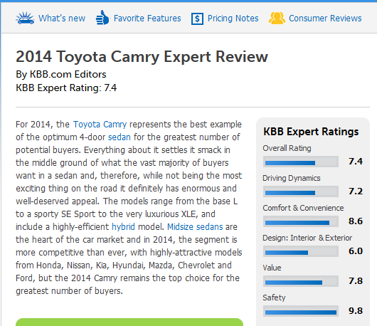
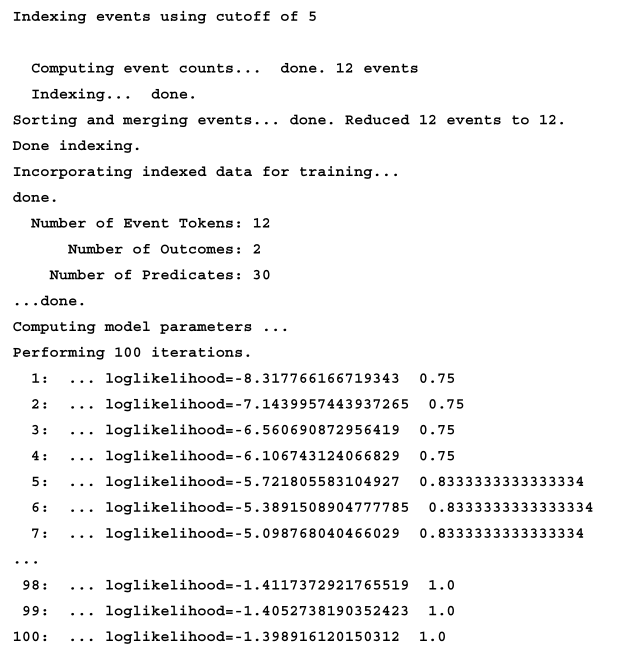
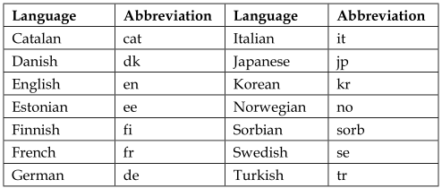

# Classifying Texts and Documents

## How classification is used


## Understanding sentiment analysis



## Text classifying techniques

## Using APIs to classify text

### Using OpenNLP

#### Training an OpenNLP classification model

代码可能是有错误

```Java
    DoccatModel model = null;
    try (InputStream dataIn =
        new FileInputStream("en-animal.train");
    OutputStream dataOut =
        new FileOutputStream("en-animal.model");) {
    ObjectStream<String> lineStream
            = new PlainTextByLineStream(dataIn, "UTF-8");
    ObjectStream<DocumentSample> sampleStream =
            new DocumentSampleStream(lineStream);
    model = DocumentCategorizerME.train("en", sampleStream);
    ...
    } catch (IOException e) {
        // Handle exceptions
    }
```

我个人认为正确的应该是
```Java
    DoccatModel model = null;
    try {
        InputStream dataIn =
            new FileInputStream("en-animal.train");
        OutputStream dataOut =
            new FileOutputStream("en-animal.model");
        ObjectStream<String> lineStream
            = new PlainTextByLineStream(dataIn, "UTF-8");
        ObjectStream<DocumentSample> sampleStream =
            new DocumentSampleStream(lineStream);
        model = DocumentCategorizerME.train("en", sampleStream);
        ...
    } catch (IOException e) {
        // Handle exceptions
    }
```



#### Using DocumentCategorizerME to classify text

```Java
    try (InputStream modelIn =
        new FileInputStream(new File("en-animal.model"));) {
        ...
    } catch (IOException ex) {
        // Handle exceptions
    }
```

```Java
    try {
        InputStream modelIn =
            new FileInputStream(new File("en-animal.model"));
        ...
    } catch (IOException ex) {
        // Handle exceptions
    }
```

```Java
    DoccatModel model = new DoccatModel(modelIn);
    DocumentCategorizerME categorizer =
        new DocumentCategorizerME(model);
```

```Java
    double[] outcomes = categorizer.categorize(inputText);
    for (int i = 0; i < categorizer.getNumberOfCategories(); i++) {
        String category = categorizer.getCategory(i);
        System.out.println(category + " - " + outcomes[i]);
    }
```

```Java
    String toto = "Toto belongs to Dorothy Gale, the heroine of "
        + "the first and many subsequent books. In the first "
        + "book, he never spoke, although other animals, native "
        + "to Oz, did. In subsequent books, other animals "
        + "gained the ability to speak upon reaching Oz or "
        + "similar lands, but Toto remained speechless.";
```

```Java
    String calico = "This cat is also known as a calimanco cat or "
        + "clouded tiger cat, and by the abbreviation 'tortie'. "
        + "In the cat fancy, a tortoiseshell cat is patched "
        + "over with red (or its dilute form, cream) and black "
        + "(or its dilute blue) mottled throughout the coat.";
```

```Java
    System.out.println(categorizer.getBestCategory(outcomes));
    System.out.println(categorizer.getAllResults(outcomes));
```
### Using Stanford API

#### Using the ColumnDataClassifier class for classification

```Java
    ColumnDataClassifier cdc =
        new ColumnDataClassifier("box.prop");
    Classifier<String, String> classifier =
        cdc.makeClassifier(cdc.readTrainingExamples("box.train"));
```

```Ouput
3.realValued = true
testFile = .box.test
...
trainFile = .box.train
```

```
Reading dataset from box.train ... done [0.1s, 60 items].
numDatums: 60
numLabels: 3 [small, medium, large]
...
AVEIMPROVE The average improvement / current value
EVALSCORE The last available eval score
Iter ## evals ## <SCALING> [LINESEARCH] VALUE TIME |GNORM| {RELNORM}
AVEIMPROVE EVALSCORE
```

```
Iter 1 evals 1 <D> [113M 3.107E-4] 5.985E1 0.00s |3.829E1| {1.959E-1}
0.000E0 -
Iter 2 evals 5 <D> [M 1.000E0] 5.949E1 0.01s |1.862E1| {9.525E-2} 3.058E-
3 -
Iter 3 evals 6 <D> [M 1.000E0] 5.923E1 0.01s |1.741E1| {8.904E-2} 3.485E-
3 -
...
Iter 21 evals 24 <D> [1M 2.850E-1] 3.306E1 0.02s |4.149E-1| {2.122E-3}
1.775E-4 -
Iter 22 evals 26 <D> [M 1.000E0] 3.306E1 0.02s
QNMinimizer terminated due to average improvement: | newest_val -
previous_val | / |newestVal| < TOL
Total time spent in optimization: 0.07s
```

```Java
    for (String line :
        ObjectBank.getLineIterator("box.test", "utf-8")) {
        ...
    }
```

```Java
    Datum<String, String> datum = cdc.makeDatumFromLine(line);
    System.out.println("Datum: {"
        + line + "]\tPredicted Category: "
        + classifier.classOf(datum));
```

```
Datum: {small 1.33 3.50 5.43] Predicted Category: medium
Datum: {small 1.18 1.73 3.14] Predicted Category: small
...
Datum: {large 6.01 9.35 16.64] Predicted Category: large
Datum: {large 6.76 9.66 15.44] Predicted Category: large
```

```Java
    String sample[] = {"", "6.90", "9.8", "15.69"};
    Datum<String, String> datum =
        cdc.makeDatumFromStrings(sample);
    System.out.println("Category: " + classifier.classOf(datum));
```

```
Category: large
```

#### Using the Stanford pipeline to perform sentiment analysis

```Java
    String review = "An overly sentimental film with a somewhat "
        + "problematic message, but its sweetness and charm "
        + "are occasionally enough to approximate true depth "
        + "and grace. ";

    String sam = "Sam was an odd sort of fellow. Not prone "
        + "to angry and not prone to merriment. Overall, "
        + "an odd fellow.";

    String mary = "Mary thought that custard pie was the "
        + "best pie in the world. However, she loathed "
        + "chocolate pie.";
```

```Java
    Properties props = new Properties();
    props.put("annotators", "tokenize, ssplit, parse, sentiment");
    StanfordCoreNLP pipeline = new StanfordCoreNLP(props);
```

```Java
    Annotation annotation = new Annotation(review);
    pipeline.annotate(annotation);
```

```Java
    String[] sentimentText = {"Very Negative", "Negative",
        "Neutral", "Positive", "Very Positive"};
```

```Java
    for (CoreMap sentence : annotation.get(
        CoreAnnotations.SentencesAnnotation.class)) {
        Tree tree = sentence.get(
        SentimentCoreAnnotations.AnnotatedTree.class);
        int score = RNNCoreAnnotations.getPredictedClass(tree);
        System.out.println(sentimentText[score]);
    }
```


### Using LingPipe to classify text

```Java
    String[] categories = {"soc.religion.christian",
        "talk.religion.misc","alt.atheism","misc.forsale"};
```

```Java
    int nGramSize = 6;
    DynamicLMClassifier<NGramProcessLM> classifier =
        DynamicLMClassifier.createNGramProcess(
            categories, nGramSize);
```

#### Training text using the Classified class

```Java
    String directory = ".../demos";
    File trainingDirectory = new File(directory
        + "/data/fourNewsGroups/4news-train");
```

```Java
    for (int i = 0; i < categories.length; ++i) {
        File classDir =
            new File(trainingDirectory, categories[i]);
        String[] trainingFiles = classDir.list();
        // Inner for-loop
    }
```

```Java
    for (int j = 0; j < trainingFiles.length; ++j) {
        try {
            File file = new File(classDir, trainingFiles[j]);
            String text = Files.readFromFile(file, "ISO-8859-1");
            Classification classification =
                new Classification(categories[i]);
            Classified<CharSequence> classified =
                new Classified<>(text, classification);
            classifier.handle(classified);
        } catch (IOException ex) {
            // Handle exceptions
        }
    }
```

```Java
    try {
        AbstractExternalizable.compileTo( (Compilable) classifier,
            new File("classifier.model"));
    } catch (IOException ex) {
        // Handle exceptions
    }
```


#### Using other training categories


+---------------------------+-----------------------+
| Newsgroups                |                       |
+===========================+=======================+
|comp.graphics              | sci.crypt             | 
+---------------------------+-----------------------+
|comp.os.ms-windows.misc    |sci.electronics        | 
+---------------------------+-----------------------+
|comp.sys.ibm.pc.hardware   |sci.med                | 
+---------------------------+-----------------------+
|comp.sys.mac.hardware      |sci.space              | 
+---------------------------+-----------------------+
|comp.windows.x             |misc.forsale           | 
+---------------------------+-----------------------+
|rec.autos                  |talk.politics.misc     | 
+---------------------------+-----------------------+
|rec.motorcycles            |talk.politics.guns     |
+---------------------------+-----------------------+
|rec.sport.baseball         |talk.politics.mideast  |
+---------------------------+-----------------------+
|rec.sport.hockey           |talk.religion.misc     |
+---------------------------+-----------------------+
|alt.atheism                |                       |
+---------------------------+-----------------------+


#### Classifying text using LingPipe

```Java
    String forSale =
        "Finding a home for sale has never been "
        + "easier. With Homes.com, you can search new "
        + "homes, foreclosures, multi-family homes, "
        + "as well as condos and townhouses for sale. "
        + "You can even search our real estate agent "
        + "directory to work with a professional "
        + "Realtor and find your perfect home.";

    String martinLuther =
        "Luther taught that salvation and subsequently "
        + "eternity in heaven is not earned by good deeds "
        + "but is received only as a free gift of God's "
        + "grace through faith in Jesus Christ as redeemer "
        + "from sin and subsequently eternity in Hell.";
```

```Java
    LMClassifier classifier = null;
    try {
        classifier = (LMClassifier)
        AbstractExternalizable.readObject(
        new File("classifier.model"));
    } catch (IOException | ClassNotFoundException ex) {
        // Handle exceptions
    }
```

```Java
    JointClassification classification =
    classifier.classify(text);
    System.out.println("Text: " + text);
    String bestCategory = classification.bestCategory();
    System.out.println("Best Category: " + bestCategory);
```

```
Text: Finding a home for sale has never been easier. With Homes.com,
you can search new homes, foreclosures, multi-family homes, as well as
condos and townhouses for sale. You can even search our real estate agent
directory to work with a professional Realtor and find your perfect home.
Best Category: misc.forsale
```

```
Text: Luther taught that salvation and subsequently eternity in heaven
is not earned by good deeds but is received only as a free gift of God's
grace through faith in Jesus Christ as redeemer from sin and subsequently
eternity in Hell.
Best Category: soc.religion.christian
```


#### Sentiment analysis using LingPipe

```Java
    categories = new String[2];
    categories[0] = "neg";
    categories[1] = "pos";
    nGramSize = 8;
    classifier = DynamicLMClassifier.createNGramProcess(
        categories, nGramSize);
```

```Java
    String directory = "...";
    File trainingDirectory = new File(directory, "txt_sentoken");
    for (int i = 0; i < categories.length; ++i) {
        Classification classification =
        new Classification(categories[i]);
        File file = new File(trainingDirectory, categories[i]);
        File[] trainingFiles = file.listFiles();
        for (int j = 0; j < trainingFiles.length; ++j) {
            try {
                String review = Files.readFromFile(
                    trainingFiles[j], "ISO-8859-1");
                Classified<CharSequence> classified =
                    new Classified<>(review, classification);
                classifier.handle(classified);
            } catch (IOException ex) {
                ex.printStackTrace();
            }
        }
    }
```

```Java
    String review = "An overly sentimental film with a somewhat "
        + "problematic message, but its sweetness and charm "
        + "are occasionally enough to approximate true depth "
        + "and grace. ";
```

```Java
    Classification classification = classifier.classify(review);
    String bestCategory = classification.bestCategory();
    System.out.println("Best Category: " + bestCategory);
```
#### Language identification using LingPipe



```Java
    String text = "An overly sentimental film with a somewhat "
        + "problematic message, but its sweetness and charm "
        + "are occasionally enough to approximate true depth "
        + "and grace. ";
    System.out.println("Text: " + text);
```

```Java
    LMClassifier classifier = null;
    try {
        classifier = (LMClassifier)
        AbstractExternalizable.readObject(
        new File(".../langid-leipzig.classifier"));
    } catch (IOException | ClassNotFoundException ex) {
        // Handle exceptions
    }
```

```Java
    Classification classification = classifier.classify(text);
    String bestCategory = classification.bestCategory();
    System.out.println("Best Language: " + bestCategory);
```

```
Text: An overly sentimental film with a somewhat problematic message, but
its sweetness and charm are occasionally enough to approximate true depth
and grace.
Best Language: en
```

```Java
    text = "Svenska är ett östnordiskt språk som talas av cirka "
        + "tio miljoner personer[1], främst i Finland "
        + "och Sverige.";
```

```
Text: Svenska är ett östnordiskt språk som talas av cirka tio miljoner
personer[1], främst i Finland och Sverige.
Best Language: se
```

## Summary


## 本章术语对照表

